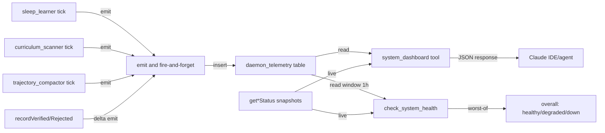

# Observability & Telemetry Implementation Plan

> **For agentic workers:** REQUIRED SUB-SKILL: Use `superpowers:subagent-driven-development` (recommended) or `superpowers:executing-plans` to implement this plan task-by-task. Steps use checkbox (`- [ ]`) syntax for tracking.

**Goal:** Persist every daemon run-event to Supabase and surface aggregated telemetry through a new `system_dashboard` MCP tool, so the three background daemons (sleep_learner, curriculum_scanner, trajectory_compactor) become observable on Day 2.

**Architecture:** An append-only `daemon_telemetry` table receives one row per daemon run-event (`run_started` / `run_ended` / `run_errored`) via a shared fire-and-forget `emit()` helper. Existing in-memory `get*Status()` snapshots are **preserved** — they remain the fast path for `check_system_health` instant reads. The new `system_dashboard` MCP tool combines persisted history (last-N runs, 1h/24h rollups, error rate) with the live snapshots, and `check_system_health` gets a single derivation step that converts persisted error-rate + staleness into an overall `healthy / degraded / down` verdict. Boundary Invariant #1 stays intact: no model imports, no network endpoints beyond Supabase.

**Tech Stack:** Supabase Postgres (migration `016_daemon_telemetry.sql`), TypeScript, `@modelcontextprotocol/sdk` tool registration, Zod input schemas, existing `src/lib/supabase.ts` admin client.

**Backlog mapping:** Task 1+2 → backlog #119. Tasks 3-5 → #120. Task 6 → #121. Task 7 → #122. Task 8 → #123.

**Foundation status:** `npm run build` green at plan time (lint:boundaries + tsc clean). All work below proceeds on top of S22 wrap-up commit `ee1fc9c`.

---

## File Structure

**New files:**
- `scripts/016_daemon_telemetry.sql` — table + indexes + RLS policy
- `src/telemetry/types.ts` — `DaemonName`, `EventType`, `MetricEvent` discriminated union
- `src/telemetry/emit.ts` — `emit(event)` fire-and-forget helper
- `src/tools/system_dashboard.ts` — read-API handler returning per-daemon rollups
- `scripts/test-obs-emit-smoke.ts` — emit-side smoke
- `scripts/test-obs-dashboard-smoke.ts` — dashboard rollup smoke
- `scripts/test-obs-health-derivation-smoke.ts` — derived-status smoke

**Modified files (named lines from recon — verify with Read before editing):**
- `src/trajectory/daemon.ts:194-205` — wrap tick run-start / run-end / catch with emit calls
- `src/sleep/daemon.ts:175-191` — same pattern
- `src/curriculum/daemon.ts:144-157` plus the `recordVerified` / `recordRejected` exports at `L188-195` — emit on the external-mutation paths too
- `src/tools/health.ts:5-7, 44-46, 224-226` — extend `HealthReport` with derived status block; no field flattening of existing snapshots
- `src/index.ts:566-573` — register `system_dashboard` adjacent to `check_system_health`
- `ARCHITECTURE.md` — new §Observability subsystem + Mermaid block (≤40 nodes)

---

## Task 1: Migration — `daemon_telemetry` table

**Files:**
- Create: `scripts/016_daemon_telemetry.sql`

**Design rationale:** matches the `trajectory_summaries` (011) append-only precedent: single `created_at`, no `updated_at`, `project_id text not null` (no FK — multi-tenant string key including the GLOBAL pseudo-project). RLS is non-negotiable: `deny_anon_authenticated`, all grants to `service_role` only. Indexes mirror the read paths: `(project_id, daemon, created_at desc)` for per-daemon history, `(daemon, created_at desc)` for cross-project ops, GIN `jsonb_path_ops` on `payload` for ad-hoc counter queries.

- [ ] **Step 1: Write the migration**

Create `scripts/016_daemon_telemetry.sql`:

```sql
-- Migration 016: daemon_telemetry — append-only event log for background daemons.
-- One row per daemon tick: 'run_started' (no payload counters yet), 'run_ended' (with counters + duration_ms),
-- 'run_errored' (with error_message + duration_ms). Read via the system_dashboard MCP tool.

create table if not exists public.daemon_telemetry (
  id              bigserial primary key,
  project_id      text        not null,
  daemon          text        not null check (daemon in ('sleep_learner','curriculum_scanner','trajectory_compactor')),
  event_type      text        not null check (event_type in ('run_started','run_ended','run_errored','task_outcome')),
  payload         jsonb       not null default '{}'::jsonb,
  created_at      timestamptz not null default now()
);

create index if not exists daemon_telemetry_project_daemon_created_idx
  on public.daemon_telemetry (project_id, daemon, created_at desc);

create index if not exists daemon_telemetry_daemon_created_idx
  on public.daemon_telemetry (daemon, created_at desc);

create index if not exists daemon_telemetry_payload_gin
  on public.daemon_telemetry using gin (payload jsonb_path_ops);

alter table public.daemon_telemetry enable row level security;

create policy deny_anon_authenticated_daemon_telemetry
  on public.daemon_telemetry
  for all
  to anon, authenticated
  using (false)
  with check (false);

grant select, insert on public.daemon_telemetry to service_role;
grant usage, select on sequence public.daemon_telemetry_id_seq to service_role;
```

- [ ] **Step 2: Apply the migration**

Run: `npm run apply-schema -- scripts/016_daemon_telemetry.sql`
Expected: exits 0, no errors. Re-running must be a no-op (every DDL guarded by `if not exists` / `or replace`).

- [ ] **Step 3: Verify the table exists with the expected shape**

Create `scripts/test-obs-emit-smoke.ts` (smoke driver — used again in Task 2):

```typescript
import { getSupabaseAdmin } from "../src/lib/supabase.js";

async function main() {
  const sb = getSupabaseAdmin();
  const { data, error } = await sb
    .from("daemon_telemetry")
    .select("id, project_id, daemon, event_type, payload, created_at")
    .limit(1);
  if (error) throw new Error(`schema check failed: ${error.message}`);
  console.log("ok: daemon_telemetry schema reachable, sample rows:", data?.length ?? 0);
}
main().catch((e) => { console.error(e); process.exit(1); });
```

Run: `npx tsx scripts/test-obs-emit-smoke.ts`
Expected: `ok: daemon_telemetry schema reachable, sample rows: 0`

- [ ] **Step 4: Commit**

```bash
git add scripts/016_daemon_telemetry.sql scripts/test-obs-emit-smoke.ts
git commit -m "feat(obs): scripts/016_daemon_telemetry.sql — append-only daemon telemetry table + RLS"
```

---

## Task 2: TypeScript telemetry types + emit helper

**Files:**
- Create: `src/telemetry/types.ts`
- Create: `src/telemetry/emit.ts`
- Modify: `scripts/test-obs-emit-smoke.ts` (extend with a real insert + readback)

**Design rationale:** `emit()` is fire-and-forget (returns a `Promise<void>` that always resolves). Telemetry MUST NEVER crash a daemon — Supabase errors are caught, logged via `console.error`, and swallowed. The discriminated union forces per-event payload typing so callers can't omit `duration_ms` on `run_ended`.

- [ ] **Step 1: Write the failing smoke (extend `test-obs-emit-smoke.ts`)**

Replace the file with:

```typescript
import { emit } from "../src/telemetry/emit.js";
import { getSupabaseAdmin } from "../src/lib/supabase.js";

async function main() {
  const sb = getSupabaseAdmin();
  const stamp = `s23-obs-smoke-${Date.now()}`;
  await emit({
    daemon: "trajectory_compactor",
    event: "run_ended",
    payload: { compacted: 0, skipped: 0, errored: 0, duration_ms: 12, smoke_tag: stamp },
  });
  const { data, error } = await sb
    .from("daemon_telemetry")
    .select("daemon, event_type, payload")
    .contains("payload", { smoke_tag: stamp })
    .limit(1);
  if (error) throw new Error(`readback failed: ${error.message}`);
  if (!data?.length) throw new Error("emit did not persist a row");
  const row = data[0];
  if (row.daemon !== "trajectory_compactor" || row.event_type !== "run_ended") {
    throw new Error(`unexpected row: ${JSON.stringify(row)}`);
  }
  console.log("ok: emit persisted + readback matched");
}
main().catch((e) => { console.error(e); process.exit(1); });
```

- [ ] **Step 2: Run the smoke; verify it fails**

Run: `npx tsx scripts/test-obs-emit-smoke.ts`
Expected: FAIL with "Cannot find module '../src/telemetry/emit.js'"

- [ ] **Step 3: Write the types module**

Create `src/telemetry/types.ts`:

```typescript
export type DaemonName = "sleep_learner" | "curriculum_scanner" | "trajectory_compactor";
export type EventType  = "run_started" | "run_ended" | "run_errored" | "task_outcome";

export type SleepEndedPayload = {
  mined: number;
  skipped: number;
  errored: number;
  duration_ms: number;
  [extra: string]: unknown;
};

export type CurriculumEndedPayload = {
  queued: number;
  skipped: number;
  errored: number;
  duration_ms: number;
  [extra: string]: unknown;
};

export type CurriculumDeltaPayload = {
  verified?: number;
  rejected?: number;
  auto_promoted?: number;
};

export type TrajectoryEndedPayload = {
  compacted: number;
  skipped: number;
  errored: number;
  duration_ms: number;
  [extra: string]: unknown;
};

export type RunErroredPayload = {
  error_message: string;
  duration_ms: number;
};

export type MetricEvent =
  | { daemon: DaemonName;              event: "run_started";  payload?: Record<string, unknown> }
  | { daemon: "sleep_learner";         event: "run_ended";    payload: SleepEndedPayload }
  | { daemon: "curriculum_scanner";    event: "run_ended";    payload: CurriculumEndedPayload }
  | { daemon: "trajectory_compactor";  event: "run_ended";    payload: TrajectoryEndedPayload }
  | { daemon: "curriculum_scanner";    event: "task_outcome"; payload: CurriculumDeltaPayload }
  | { daemon: DaemonName;              event: "run_errored";  payload: RunErroredPayload };
```

- [ ] **Step 4: Write the emit helper**

Create `src/telemetry/emit.ts`:

```typescript
import { getSupabaseAdmin } from "../lib/supabase.js";
import { getProjectId } from "../lib/project.js";
import type { MetricEvent } from "./types.js";

export async function emit(event: MetricEvent): Promise<void> {
  try {
    const sb = getSupabaseAdmin();
    const { error } = await sb.from("daemon_telemetry").insert({
      project_id: getProjectId(),
      daemon: event.daemon,
      event_type: event.event,
      payload: event.payload ?? {},
    });
    if (error) {
      console.error(`[telemetry] insert failed (${event.daemon}/${event.event}): ${error.message}`);
    }
  } catch (e) {
    console.error(`[telemetry] emit threw (${event.daemon}/${event.event}):`, e);
  }
}
```

Note for implementer: if `getProjectId` lives under a different path, Grep `getProjectId` in `src/` and use the existing import path. Do NOT introduce a new project-id resolver.

- [ ] **Step 5: Re-run the smoke; verify it passes**

Run: `npx tsx scripts/test-obs-emit-smoke.ts`
Expected: `ok: emit persisted + readback matched`

- [ ] **Step 6: Commit**

```bash
git add src/telemetry/types.ts src/telemetry/emit.ts scripts/test-obs-emit-smoke.ts
git commit -m "feat(obs): src/telemetry — emit() fire-and-forget helper + typed events"
```

---

## Task 3: Instrument `trajectory_compactor` (simplest daemon — proves the pattern)

**Files:**
- Modify: `src/trajectory/daemon.ts:194-205`
- Create: `scripts/test-obs-trajectory-smoke.ts`

**Design rationale:** Trajectory compactor has the smallest state surface (per-run only, no rolling totals) so it validates the seam pattern in isolation. The existing in-memory `state` block at L18-30 is **preserved** — emit calls are added alongside, not as replacements.

- [ ] **Step 1: Write the failing smoke**

Create `scripts/test-obs-trajectory-smoke.ts`:

```typescript
import { getSupabaseAdmin } from "../src/lib/supabase.js";
import { runTrajectoryCompactorOnce } from "../src/trajectory/daemon.js";

async function main() {
  const sb = getSupabaseAdmin();
  const before = new Date().toISOString();
  await runTrajectoryCompactorOnce();
  const { data, error } = await sb
    .from("daemon_telemetry")
    .select("event_type, payload, created_at")
    .eq("daemon", "trajectory_compactor")
    .gte("created_at", before)
    .order("created_at", { ascending: true });
  if (error) throw new Error(`readback failed: ${error.message}`);
  const types = (data ?? []).map((r) => r.event_type);
  if (!types.includes("run_started")) throw new Error("missing run_started");
  if (!(types.includes("run_ended") || types.includes("run_errored"))) {
    throw new Error("missing run_ended or run_errored");
  }
  console.log("ok: trajectory_compactor emitted", types);
}
main().catch((e) => { console.error(e); process.exit(1); });
```

Note for implementer: if `runTrajectoryCompactorOnce` is not exported, Grep its current name (`tick`, `runOnce`, etc.) in `src/trajectory/daemon.ts` and either use it or export an alias. Do NOT call the auto-scheduler.

- [ ] **Step 2: Run the smoke; verify it fails**

Run: `npx tsx scripts/test-obs-trajectory-smoke.ts`
Expected: FAIL with "missing run_started"

- [ ] **Step 3: Modify `src/trajectory/daemon.ts:194-205`**

Read the file first; locate the tick function. Around L194-195 (run-start), L198-202 (run-end success), L203-205 (catch) — adapt to actual line numbers found.

Add at top of file:
```typescript
import { emit } from "../telemetry/emit.js";
```

At run-start (immediately before existing `lastRunAt = ...` assignment):
```typescript
const __tStart = Date.now();
void emit({ daemon: "trajectory_compactor", event: "run_started" });
```

At run-end success (after existing counter writes, before tick exits):
```typescript
void emit({
  daemon: "trajectory_compactor",
  event: "run_ended",
  payload: {
    compacted: state.lastRunCompacted,
    skipped: state.lastRunSkipped,
    errored: state.lastRunErrored,
    duration_ms: Date.now() - __tStart,
  },
});
```

At error-catch (replace existing catch body):
```typescript
} catch (err) {
  state.lastRunErrored = (state.lastRunErrored ?? 0) + 1;
  void emit({
    daemon: "trajectory_compactor",
    event: "run_errored",
    payload: { error_message: err instanceof Error ? err.message : String(err), duration_ms: Date.now() - __tStart },
  });
}
```

`void emit(...)` is deliberate: we don't await — telemetry must never block the tick. The helper catches its own errors.

- [ ] **Step 4: Re-run the smoke; verify it passes**

Run: `npx tsx scripts/test-obs-trajectory-smoke.ts`
Expected: `ok: trajectory_compactor emitted [ 'run_started', 'run_ended' ]`

- [ ] **Step 5: Run the build gate**

Run: `npm run build`
Expected: lint:boundaries passes (telemetry imports are local — no forbidden symbols); tsc emits 0 errors.

- [ ] **Step 6: Commit**

```bash
git add src/trajectory/daemon.ts scripts/test-obs-trajectory-smoke.ts
git commit -m "feat(obs): instrument trajectory_compactor with emit() at run-start/end/error"
```

---

## Task 4: Instrument `sleep_learner`

**Files:**
- Modify: `src/sleep/daemon.ts:175-191`
- Create: `scripts/test-obs-sleep-smoke.ts`

**Design rationale:** Identical pattern to Task 3. Different field names (`mined` not `compacted`). The `candidatesMinedTotal` rolling total stays in-memory only — the table is per-run; rollups happen at read time in `system_dashboard`.

- [ ] **Step 1: Write the failing smoke**

Create `scripts/test-obs-sleep-smoke.ts` — mirror `test-obs-trajectory-smoke.ts` with `daemon: "sleep_learner"` and the right `runSleepLearnerOnce` import (Grep its actual name).

- [ ] **Step 2: Verify it fails**

Run: `npx tsx scripts/test-obs-sleep-smoke.ts`
Expected: FAIL with "missing run_started"

- [ ] **Step 3: Modify `src/sleep/daemon.ts:175-191`**

Add `import { emit } from "../telemetry/emit.js";` near top.

Run-start (before L175-177 state writes):
```typescript
const __tStart = Date.now();
void emit({ daemon: "sleep_learner", event: "run_started" });
```

Run-end success (after L183-188 counter writes):
```typescript
void emit({
  daemon: "sleep_learner",
  event: "run_ended",
  payload: {
    mined: state.lastRunMined,
    skipped: state.lastRunSkipped,
    errored: state.lastRunErrored,
    duration_ms: Date.now() - __tStart,
  },
});
```

Error-catch (extend L189-191, keep the existing `lastRunErrored++` — emit is ADDITIVE):
```typescript
} catch (err) {
  state.lastRunErrored++;
  void emit({
    daemon: "sleep_learner",
    event: "run_errored",
    payload: { error_message: err instanceof Error ? err.message : String(err), duration_ms: Date.now() - __tStart },
  });
}
```

- [ ] **Step 4: Verify it passes**

Run: `npx tsx scripts/test-obs-sleep-smoke.ts`
Expected: `ok: sleep_learner emitted [ 'run_started', 'run_ended' ]`

- [ ] **Step 5: Build gate**

Run: `npm run build` — must be green.

- [ ] **Step 6: Commit**

```bash
git add src/sleep/daemon.ts scripts/test-obs-sleep-smoke.ts
git commit -m "feat(obs): instrument sleep_learner with emit() at run-start/end/error"
```

---

## Task 5: Instrument `curriculum_scanner` (plus external counter paths)

**Files:**
- Modify: `src/curriculum/daemon.ts:144-157` and `src/curriculum/daemon.ts:188-195`
- Create: `scripts/test-obs-curriculum-smoke.ts`

**Design rationale:** Curriculum has the largest surface — beyond the tick lifecycle, `recordVerified` / `recordRejected` are externally callable from gate tools and bump rolling totals (`verifiedTotal`, `rejectedTotal`, `autoPromotionsTotal`). Emit there too, but as **`task_outcome`** events with a *delta payload* (e.g. `{ verified: 1 }`). This keeps daemon tick metrics (`run_ended` / `run_errored`) cleanly separated from orchestrator-initiated state mutations — `rollup.runs` then counts only true daemon ticks, and `task_outcome` rollups are surfaced separately in `system_dashboard`. Semantic fidelity > enum minimalism.

- [ ] **Step 1: Write the failing smoke**

Create `scripts/test-obs-curriculum-smoke.ts`:

```typescript
import { getSupabaseAdmin } from "../src/lib/supabase.js";
import { runCurriculumScannerOnce, recordVerified } from "../src/curriculum/daemon.js";

async function main() {
  const sb = getSupabaseAdmin();
  const before = new Date().toISOString();
  await runCurriculumScannerOnce();
  recordVerified();
  // recordVerified is synchronous in the existing code; allow the fire-and-forget insert to flush.
  await new Promise((r) => setTimeout(r, 300));

  const { data, error } = await sb
    .from("daemon_telemetry")
    .select("event_type, payload")
    .eq("daemon", "curriculum_scanner")
    .gte("created_at", before)
    .order("created_at", { ascending: true });
  if (error) throw new Error(`readback failed: ${error.message}`);
  const types = (data ?? []).map((r) => r.event_type);
  if (!types.includes("run_started")) throw new Error("missing run_started");
  const sawDelta = (data ?? []).some(
    (r) => r.event_type === "task_outcome" && typeof (r.payload as any)?.verified === "number"
  );
  if (!sawDelta) throw new Error("missing recordVerified delta event");
  console.log("ok: curriculum_scanner tick + delta both emitted");
}
main().catch((e) => { console.error(e); process.exit(1); });
```

- [ ] **Step 2: Verify it fails**

Run: `npx tsx scripts/test-obs-curriculum-smoke.ts`
Expected: FAIL with either "missing run_started" or "missing recordVerified delta event"

- [ ] **Step 3: Modify the tick (L144-157)**

Same `__tStart` + run-start / run-end / catch pattern as Tasks 3-4, using counters `queued / skipped / errored` for the `run_ended` payload.

- [ ] **Step 4: Modify `recordVerified` / `recordRejected` (L188-195)**

Each existing function increments a total. Add immediately after the increment:

```typescript
// recordVerified:
void emit({ daemon: "curriculum_scanner", event: "task_outcome", payload: { verified: 1 } });

// recordRejected:
void emit({ daemon: "curriculum_scanner", event: "task_outcome", payload: { rejected: 1 } });
```

If `recordAutoPromoted` exists (Grep), add the analogous `task_outcome` emit with `payload: { auto_promoted: 1 }`.

- [ ] **Step 5: Verify it passes**

Run: `npx tsx scripts/test-obs-curriculum-smoke.ts`
Expected: `ok: curriculum_scanner tick + delta both emitted`

- [ ] **Step 6: Build gate + commit**

```bash
npm run build
git add src/curriculum/daemon.ts scripts/test-obs-curriculum-smoke.ts
git commit -m "feat(obs): instrument curriculum_scanner tick + recordVerified/Rejected delta emits"
```

---

## Task 6: `system_dashboard` MCP tool

**Files:**
- Create: `src/tools/system_dashboard.ts`
- Modify: `src/index.ts:566-573` — register the tool adjacent to `check_system_health`
- Create: `scripts/test-obs-dashboard-smoke.ts`

**Design rationale:** One read query per daemon, bucketed in JS (no Postgres date_trunc gymnastics for v1 — keep the SQL trivial). Inputs are zero-arg by default; optional `window_hours` (default 24) and optional `daemon` filter. Output structure is stable so the IDE/agent can consume it without parsing.

- [ ] **Step 1: Write the failing smoke**

Create `scripts/test-obs-dashboard-smoke.ts`:

```typescript
import { systemDashboardHandler } from "../src/tools/system_dashboard.js";

async function main() {
  const result = await systemDashboardHandler({});
  if (!result.daemons || typeof result.daemons !== "object") throw new Error("missing daemons block");
  for (const d of ["sleep_learner", "curriculum_scanner", "trajectory_compactor"] as const) {
    const block = result.daemons[d];
    if (!block) throw new Error(`missing daemon block: ${d}`);
    if (typeof block.rollup_1h?.runs !== "number") throw new Error(`${d}: missing rollup_1h.runs`);
    if (typeof block.rollup_24h?.runs !== "number") throw new Error(`${d}: missing rollup_24h.runs`);
    if (typeof block.error_rate_24h !== "number") throw new Error(`${d}: missing error_rate_24h`);
  }
  console.log("ok: system_dashboard returns full shape");
}
main().catch((e) => { console.error(e); process.exit(1); });
```

- [ ] **Step 2: Verify it fails**

Run: `npx tsx scripts/test-obs-dashboard-smoke.ts`
Expected: FAIL with module-not-found.

- [ ] **Step 3: Write the handler**

Create `src/tools/system_dashboard.ts`:

```typescript
import { getSupabaseAdmin } from "../lib/supabase.js";
import { getProjectId } from "../lib/project.js";
import { getSleepLearnerStatus } from "../sleep/daemon.js";
import { getCurriculumScannerStatus } from "../curriculum/daemon.js";
import { getTrajectoryCompactorStatus } from "../trajectory/daemon.js";

type DaemonName = "sleep_learner" | "curriculum_scanner" | "trajectory_compactor";

export type DashboardInput = {
  window_hours?: number;
  daemon?: DaemonName;
};

type Row = { daemon: string; event_type: string; payload: Record<string, unknown>; created_at: string };

function rollup(rows: Row[], sinceMs: number): { runs: number; errors: number; items: number } {
  const filtered = rows.filter((r) => Date.parse(r.created_at) >= sinceMs);
  const runs   = filtered.filter((r) => r.event_type === "run_ended").length;
  const errors = filtered.filter((r) => r.event_type === "run_errored").length;
  const items  = filtered.reduce((acc, r) => {
    const p = r.payload ?? {};
    const n =
      (typeof p.compacted === "number" ? p.compacted : 0) +
      (typeof p.mined === "number" ? p.mined : 0) +
      (typeof p.queued === "number" ? p.queued : 0) +
      (typeof p.verified === "number" ? p.verified : 0) +
      (typeof p.rejected === "number" ? p.rejected : 0) +
      (typeof p.auto_promoted === "number" ? p.auto_promoted : 0);
    return acc + n;
  }, 0);
  return { runs, errors, items };
}

export async function systemDashboardHandler(input: DashboardInput) {
  const windowHours = input.window_hours ?? 24;
  const sinceIso = new Date(Date.now() - windowHours * 3600_000).toISOString();
  const sb = getSupabaseAdmin();
  let q = sb
    .from("daemon_telemetry")
    .select("daemon, event_type, payload, created_at")
    .eq("project_id", getProjectId())
    .gte("created_at", sinceIso)
    .order("created_at", { ascending: false })
    .limit(2000);
  if (input.daemon) q = q.eq("daemon", input.daemon);
  const { data, error } = await q;
  if (error) throw new Error(`system_dashboard query failed: ${error.message}`);
  const rows = (data ?? []) as Row[];

  const live = {
    sleep_learner:        getSleepLearnerStatus(),
    curriculum_scanner:   getCurriculumScannerStatus(),
    trajectory_compactor: getTrajectoryCompactorStatus(),
  };

  const now = Date.now();
  const oneHourAgo  = now - 3600_000;
  const windowStart = now - windowHours * 3600_000;
  const daemons: Record<string, unknown> = {};

  for (const d of ["sleep_learner", "curriculum_scanner", "trajectory_compactor"] as const) {
    if (input.daemon && input.daemon !== d) continue;
    const daemonRows = rows.filter((r) => r.daemon === d);
    const r1h  = rollup(daemonRows, oneHourAgo);
    const r24h = rollup(daemonRows, windowStart);
    const lastError = daemonRows.find((r) => r.event_type === "run_errored");
    daemons[d] = {
      live: live[d],
      rollup_1h: r1h,
      rollup_24h: r24h,
      error_rate_24h: r24h.runs + r24h.errors === 0 ? 0 : r24h.errors / (r24h.runs + r24h.errors),
      last_error_at: lastError?.created_at ?? null,
      last_error_message: (lastError?.payload as { error_message?: string } | undefined)?.error_message ?? null,
      recent_runs: daemonRows.slice(0, 20).map((r) => ({
        event_type: r.event_type,
        created_at: r.created_at,
        payload: r.payload,
      })),
    };
  }

  return {
    project_id: getProjectId(),
    window_hours: windowHours,
    generated_at: new Date().toISOString(),
    daemons,
  };
}
```

- [ ] **Step 4: Register the tool in `src/index.ts:566-573` (adjacent to `check_system_health`)**

Add:

```typescript
import { systemDashboardHandler } from "./tools/system_dashboard.js";

// ... near check_system_health registration:
server.tool(
  "system_dashboard",
  "Unified read API for daemon telemetry. Returns per-daemon live status, 1h and 24h rollups (runs, errors, items), 24h error_rate, last error, and the last 20 recent run events. Backed by the daemon_telemetry table (append-only). Inputs: optional window_hours (default 24), optional daemon filter ('sleep_learner' | 'curriculum_scanner' | 'trajectory_compactor').",
  {
    window_hours: z.number().int().positive().max(168).optional(),
    daemon: z.enum(["sleep_learner", "curriculum_scanner", "trajectory_compactor"]).optional(),
  },
  async (args) => {
    const out = await systemDashboardHandler(args);
    return { content: [{ type: "text", text: JSON.stringify(out, null, 2) }] };
  },
);
```

If `z` is already imported at top of file, do not re-import.

- [ ] **Step 5: Verify smoke passes**

Run: `npx tsx scripts/test-obs-dashboard-smoke.ts`
Expected: `ok: system_dashboard returns full shape`

- [ ] **Step 6: Build gate + commit**

```bash
npm run build
git add src/tools/system_dashboard.ts src/index.ts scripts/test-obs-dashboard-smoke.ts
git commit -m "feat(obs): system_dashboard MCP tool — per-daemon rollups + recent runs"
```

---

## Task 7: Derived health status in `check_system_health`

**Files:**
- Modify: `src/tools/health.ts:5-7, 44-46, 224-226`
- Create: `scripts/test-obs-health-derivation-smoke.ts`

**Design rationale:** Today the `overall` field in `check_system_health` is computed from Supabase + Ollama reachability only — the daemons could be silently failing every tick and the system would still report `healthy`. Add a `derived` block per daemon: `status: 'healthy'|'degraded'|'down'` based on (a) 1h error_rate threshold and (b) staleness vs `interval_ms × 2`. Roll up to the existing `overall` field via the worst-of-all rule.

**Thresholds (env-driven from day 1; sensible defaults below):**
- `OBS_ERR_RATE_DEGRADED` (default `0.20`) — if `error_rate_1h` strictly above, daemon → `degraded`
- `OBS_ERR_RATE_DOWN` (default `0.50`) — if `error_rate_1h` strictly above, daemon → `down`
- `OBS_STALENESS_MULTIPLIER` (default `2`) — if `now - last_run_ended > interval_ms × multiplier` AND daemon enabled → `down`
- Unparseable env values fall back to defaults; the helper never throws.
- Else → `healthy`

- [ ] **Step 1: Write the failing smoke**

Create `scripts/test-obs-health-derivation-smoke.ts` — call `checkSystemHealth`, assert every daemon in the response has a `derived: { status, error_rate_1h, last_run_ended_at, reason }` block, and that `overall` ∈ `{'healthy','degraded','down'}`.

- [ ] **Step 2: Verify it fails**

Run: `npx tsx scripts/test-obs-health-derivation-smoke.ts`
Expected: FAIL with "missing derived block".

- [ ] **Step 3: Modify `src/tools/health.ts`**

Read the three thresholds from env at module load with safe parsing — defaults are used for missing OR unparseable values; the helper must never throw:

```typescript
const envNum = (k: string, def: number) => {
  const raw = process.env[k];
  if (raw === undefined) return def;
  const n = Number(raw);
  return Number.isFinite(n) ? n : def;
};
const ERR_DEGRADED = envNum("OBS_ERR_RATE_DEGRADED", 0.20);
const ERR_DOWN     = envNum("OBS_ERR_RATE_DOWN", 0.50);
const STALE_MULT   = envNum("OBS_STALENESS_MULTIPLIER", 2);
```

Add a `deriveDaemonStatus(rows, intervalMs, enabled)` helper that consumes those three constants. Inside `checkSystemHealth` (around L224-226), after the existing snapshot assembly, query the last 1h of `daemon_telemetry` once (single query, group in JS by daemon) and attach a `derived` block to each daemon snapshot. Roll up to `overall`:

```typescript
const statuses = ["sleep_learner","curriculum_scanner","trajectory_compactor"]
  .map((d) => report[d].derived.status);
report.overall =
  statuses.includes("down")     ? "down" :
  statuses.includes("degraded") ? "degraded" :
  // existing supabase/ollama checks already feed into overall — preserve those:
  report.overall;
```

Preserve the existing supabase/ollama feeding into `overall` — derived daemon status is a NEW signal that can only *worsen* overall, never improve it.

- [ ] **Step 4: Verify it passes**

Run: `npx tsx scripts/test-obs-health-derivation-smoke.ts`
Expected: `ok: derived block present, overall=healthy`

- [ ] **Step 5: Build gate + commit**

```bash
npm run build
git add src/tools/health.ts scripts/test-obs-health-derivation-smoke.ts
git commit -m "feat(obs): check_system_health derives daemon status from telemetry + staleness"
```

---

## Task 8: ARCHITECTURE.md §Observability + Mermaid diagram

**Files:**
- Modify: `ARCHITECTURE.md` — new §Observability subsystem, placed after §M5

**Design rationale:** Honors the 40-node Mermaid ceiling (the diagram below is 11 nodes, 12 edges — well within budget). Documents the persistence model and the live + derived health derivation so future agents don't need to reverse-engineer the table.

- [ ] **Step 1: Read the existing ARCHITECTURE.md to find the §M5 anchor**

Use `mcp__plugin_context-mode_context-mode__ctx_execute` with grep to locate the `## §M5` heading line.

- [ ] **Step 2: Append the new subsystem after §M5**

Add this exact block (Edit, never Write — Core 3 integrity):

```markdown
## §Observability — Daemon Telemetry & Dashboard

The three background daemons (`sleep_learner`, `curriculum_scanner`,
`trajectory_compactor`) persist every run-event to `daemon_telemetry` via a
shared fire-and-forget `emit()` helper. In-memory `get*Status()` snapshots
remain the fast path for instant reads; the table is the durable source of
truth used for rollups, error rates, and the derived `overall` status in
`check_system_health`.



**Boundary Invariant #1 preserved:** `src/telemetry/emit.ts` imports only
Supabase admin client and the project-id resolver — no model SDKs, no network
endpoints beyond Supabase.

**Failure mode:** if Supabase is unreachable, `emit()` swallows the error
locally (logs to stderr) — daemons continue ticking without telemetry rather
than crashing the process. Health derivation falls back to the existing
`supabase` connectivity check, which will already report `down` in that case.
```

- [ ] **Step 3: Build gate + commit**

```bash
npm run build
git add ARCHITECTURE.md
git commit -m "docs(obs): ARCHITECTURE.md §Observability — telemetry data flow + Mermaid"
```

---

## Self-Review Checklist (post-write)

- [x] Every backlog item (#119-#123) maps to at least one task. #119 → T1+T2. #120 → T3+T4+T5. #121 → T6. #122 → T7. #123 → T8.
- [x] No placeholders. Every step has either a code block or an exact command. The two `Grep its actual name` notes are intentional (recon gave line ranges, not symbol names) and are clearly bounded.
- [x] Type consistency: `emit()` signature, `MetricEvent` discriminated union, `getProjectId`, and the three `get*Status` imports match across Tasks 2, 3, 4, 5, 6, 7.
- [x] Boundary Invariant #1: `src/telemetry/emit.ts` imports only Supabase + project-id. Confirmed in T8 doc block and lint:boundaries config (Sleep + Curriculum directory scope).
- [x] Production-ready: every step ends green (build passes, smoke passes). No TODOs, no commented-out code, no `any` introduced (the payload type allows `[extra: string]: unknown` deliberately for forward-compatible counters).

## Open Questions for Implementer

1. **`recordAutoPromoted` existence:** Task 5 says "if it exists" — implementer must Grep. If it does not exist, drop that one emit line and continue.
2. **Function names of "runOnce" exports:** Tasks 3-5 reference `runTrajectoryCompactorOnce` / `runSleepLearnerOnce` / `runCurriculumScannerOnce`. If the actual exports are `tick` or `runOnce`, either use them directly or add a same-file `export const runXOnce = tick;` re-export (1 line). Do NOT refactor the daemon's internal naming.
3. **`getProjectId` location:** Task 2 says Grep if not at `src/lib/project.js`. The S22 hardening removed proposer.ts but did not touch the project-id resolver, so the path is likely stable — but verify before importing.

These three questions are answerable by the implementer in <5 minutes of Grep and don't require Orchestrator round-trips.

---

**End of plan.**
